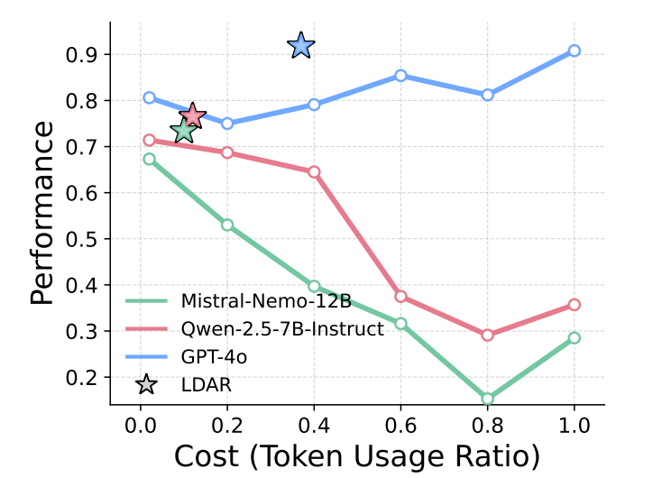

## Beyond RAG vs. Long-Context: Learning Distraction-Aware Retrieval for Efficient Knowledge Grounding
This is the official PyTorch implementation of "Learning Distraction-Aware Retrieval for Efficient Knowledge Grounding"


> Performance of LLMs across token-usage ratios. Higher ratio corresponds to retrieving more passages. Lines indicate performance when retrieving top-similarity passages within a fixed token usage ratio (1.0 = full context). ☆ marks the performance of LDAR optimized for each LLM, illustrating its ability to strike a balance between information coverage and distraction that surpasses all fixed token usage baselines.
> 

## Installation
### Step 1. Create a conda environment:
```shell
pip install --upgrade pip
conda create --name LDAR python=3.10 -y
conda activate LDAR
conda update -n base -c conda-forge conda
```
### Step 2. Install the dependencies:
```shell
pip install -r requirements.txt
```

### Step 3. Install the Open-Source LLMs and Embedding Models:
```shell
mkdir -p models
huggingface-cli login
```

```shell
# Open-Source LLMs
huggingface-cli download meta-llama/Llama-3.1-8B-Instruct --local-dir models/Meta-Llama-3___1-8B-Instruct --local-dir-use-symlinks False
huggingface-cli download meta-llama/Llama-3.2-3B-Instruct --local-dir models/Llama-3___2-3B-Instruct --local-dir-use-symlinks False
huggingface-cli download Qwen/Qwen2.5-7B-Instruct --local-dir models/Qwen-2.5-7B-Instruct --local-dir-use-symlinks False
huggingface-cli download Qwen/Qwen3-4B-Instruct-2507 --local-dir models/Qwen-3-4B-Instruct --local-dir-use-symlinks False
huggingface-cli download mistralai/Mistral-Nemo-Instruct-2407 --local-dir models/Mistral-Nemo-Instruct-2407 --local-dir-use-symlinks False
```
```shell
# Embedding Models
huggingface-cli download BAAI/bge-large-en-v1.5 --local-dir embedding_models/gte-enzh-emb-large-v1.5 --local-dir-use-symlinks False
huggingface-cli download BAAI/bge-reranker-large --local-dir embedding_models/gte-rerank-large-v1.5 --local-dir-use-symlinks False
```

## Reproduce

We provide training code for LDAR with both open-source LLMs and close-source LLMs in the `evaluation` folder:
* `evaluation/train_ldar.py`
* `evaluation/train_ldar_close.py`

To use proprietary LLMs for prediction and evaluation, please fill in your own API key in the `evaluation/train_ldar_close.py` and `evaluation/optim_utils.py` to call the model. We provide functions for GPT and Gemini models.
```python
api_key = "YOUR_API_KEY"
org_id = "THE_ORG_ID"
```
Now you can run LDAR with certain context lengths and task types:
```shell
python train_ldar.py --query_type <location, reasoning, comp> --context_length <32k, 128k> --eval_model <llama-3.1-8b, llama-3.2-3b, qwen-2.5-7b, qwen-3-4b, mistral-nemo-12b> --run_name <your_run_name>
python train_ldar_close.py --query_type <location, reasoning, comp> --context_length <32k, 128k> --eval_model <gpt-4o, gpt-4o-mini, gemini-2.5-pro, gemini-2.5-flash> --run_name <your_run_name>
```

Resume the training anytime by adding a single argument:
```shell
--checkpoint <adaptive retriever path>
```

Also, as in our paper, you can evaluate pretrained adaptive retriever on Hallucination task:
```shell
python train_ldar.py --query_type hallu --context_length <32k, 128k> --eval_model <llama-3.1-8b, llama-3.2-3b, qwen-2.5-7b, qwen-3-4b, mistral-nemo-12b> --run_name <your_run_name> --full_eval_only True --checkpoint <adaptive retriever path>
python train_ldar_close.py --query_type hallu --context_length <32k, 128k> --eval_model <gpt-4o, gpt-4o-mini, gemini-2.5-pro, gemini-2.5-flash> --run_name <your_run_name> --full_eval_only True --checkpoint <adaptive retriever path>
```

## ⭐Acknowledgement
Our implementation builds heavily on the publicly available codebases of [LaRA](https://github.com/Alibaba-NLP/LaRA), as our method is primarily developed upon them. We sincerely appreciate the original authors for sharing their code.